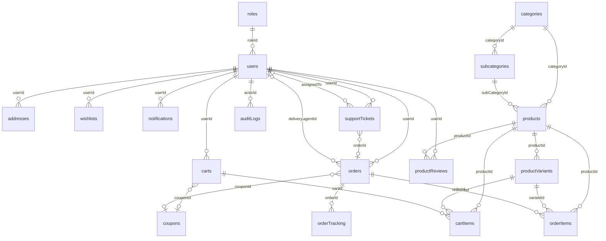

# AshityShop — MongoDB Database Architecture

> Production-ready schema design for a multi-channel e-commerce platform (Android, Web, future iOS).  
> Database name: `ashityshop`

---

## Table of Contents

1. [Recommended MongoDB Architecture](#1-recommended-mongodb-architecture)
2. [Collection List](#2-collection-list)
3. [ERD — Entity Relationships](#3-erd--entity-relationships)
4. [Embedding vs Referencing Decisions](#4-embedding-vs-referencing-decisions)
5. [Enums](#5-enums)
6. [Indexes Summary](#6-indexes-summary)
7. [Constraints & Validation Rules](#7-constraints--validation-rules)
8. [Soft Delete & Auditing](#8-soft-delete--auditing)
9. [Future-Proofing](#9-future-proofing)
10. [Schema File Map](#10-schema-file-map)

---

## 1. Recommended MongoDB Architecture

### Deployment Topology

```
┌─────────────────────────────────────────────────────────────────┐
│                     Application Layer                           │
│   Android App  │  Web App  │  Admin Panel  │  Delivery App     │
└────────────────────────────┬────────────────────────────────────┘
                             │
                    ┌────────▼────────┐
                    │   API Gateway   │
                    └────────┬────────┘
                             │
         ┌───────────────────┼───────────────────┐
         │                   │                   │
  ┌──────▼──────┐    ┌───────▼───────┐   ┌──────▼──────┐
  │  Write Ops  │    │  Read Ops     │   │  Analytics  │
  │  (Primary)  │    │  (Secondary)  │   │  (Secondary)│
  └──────┬──────┘    └───────┬───────┘   └──────┬──────┘
         │                   │                   │
         └───────────────────┼───────────────────┘
                             │
              ┌──────────────▼──────────────┐
              │   MongoDB Replica Set (3+)  │
              │   Primary + 2 Secondaries   │
              └──────────────┬──────────────┘
                             │
         ┌───────────────────┼───────────────────┐
         │                   │                   │
  ┌──────▼──────┐    ┌───────▼───────┐   ┌──────▼──────┐
  │   Change    │    │  Atlas Search │   │  S3/CDN     │
  │   Streams   │    │  (optional)   │   │  (images)   │
  └─────────────┘    └───────────────┘   └─────────────┘
```

### Operational Guidelines

| Concern | Recommendation |
|---------|----------------|
| **Replica Set** | Minimum 3 nodes (1 primary, 2 secondaries) for HA |
| **Read Preference** | `primary` for writes/carts/orders/inventory; `secondaryPreferred` for product catalog & banners |
| **Write Concern** | `w: majority` for orders, payments, inventory updates |
| **Connection Pool** | 50 max / 5 min per app instance (configured in `connection.ts`) |
| **Change Streams** | Inventory sync, order status → notifications, analytics pipeline |
| **Sharding (scale)** | Shard `orders` + `orderItems` by `{ userId: 1, createdAt: 1 }`; shard `notifications` by `userId` |
| **TTL Indexes** | Expired guest carts, old notifications (optional retention) |
| **Backup** | Continuous cloud backup + point-in-time recovery |
| **Transactions** | Use multi-document ACID for: order creation + inventory reservation + cart conversion |

### Database Separation (Optional at Scale)

| Database | Collections | Purpose |
|----------|-------------|---------|
| `ashityshop` | All transactional collections | OLTP |
| `ashityshop_analytics` | Aggregated metrics (via ETL) | OLAP / dashboards |
| `ashityshop_audit` | `auditLogs` (move when >100M docs) | Compliance isolation |

---

## 2. Collection List

| # | Collection | Model File | Soft Delete | Audit Fields | Primary Purpose |
|---|------------|------------|:-----------:|:------------:|-----------------|
| 1 | `roles` | `Role.ts` | ✅ | ✅ | RBAC permissions |
| 2 | `users` | `User.ts` | ✅ | ✅ | Authentication & profiles |
| 3 | `addresses` | `Address.ts` | ✅ | ✅ | User shipping/billing addresses |
| 4 | `categories` | `Category.ts` | ✅ | ✅ | Top-level product taxonomy |
| 5 | `subcategories` | `SubCategory.ts` | ✅ | ✅ | Second-level taxonomy |
| 6 | `products` | `Product.ts` | ✅ | ✅ | Product catalog (parent) |
| 7 | `productVariants` | `ProductVariant.ts` | ✅ | ✅ | SKU, price, inventory |
| 8 | `productReviews` | `ProductReview.ts` | ✅ | ✅ | Customer reviews |
| 9 | `wishlists` | `Wishlist.ts` | ✅ | ✅ | Saved products (embedded items) |
| 10 | `carts` | `Cart.ts` | ✅ | ✅ | Active shopping sessions |
| 11 | `cartItems` | `CartItem.ts` | ✅ | ✅ | Line items (separate for concurrency) |
| 12 | `orders` | `Order.ts` | ✅ | ✅ | Order headers + snapshots |
| 13 | `orderItems` | `OrderItem.ts` | ✅ | ✅ | Immutable order line items |
| 14 | `orderTracking` | `OrderTracking.ts` | ❌ | partial | Append-only tracking events |
| 15 | `notifications` | `Notification.ts` | ❌ | ❌ | In-app & push notification log |
| 16 | `coupons` | `Coupon.ts` | ✅ | ✅ | Discount codes |
| 17 | `banners` | `Banner.ts` | ✅ | ✅ | Homepage/promo banners |
| 18 | `supportTickets` | `SupportTicket.ts` | ✅ | ✅ | Customer support |
| 19 | `auditLogs` | `AuditLog.ts` | ❌ | ❌ | Immutable audit trail |
| 20 | `settings` | `Setting.ts` | ✅ | ✅ | App configuration key-value store |

**Total: 20 collections** (as specified)

---

## 3. ERD — Entity Relationships

### High-Level Relationship Diagram



### Cardinality Reference

```
roles          1 ──────< N  users
users          1 ──────< N  addresses
users          1 ──────< N  wishlists
users          1 ──────< 1  carts (active, partial unique index)
users          1 ──────< N  orders
users          1 ──────< N  productReviews (1 per product, unique)
users          1 ──────< N  notifications
users          1 ──────< N  supportTickets

categories     1 ──────< N  subcategories
categories     1 ──────< N  products
subcategories  1 ──────< N  products
products       1 ──────< N  productVariants
products       1 ──────< N  productReviews

carts          1 ──────< N  cartItems
orders         1 ──────< N  orderItems
orders         1 ──────< N  orderTracking (timeline events)

coupons        1 ──────< N  orders (optional)
coupons        1 ──────< N  carts (optional)
```

### Relationship Types Legend

| Symbol | Meaning |
|--------|---------|
| `──<` | One-to-many (reference via ObjectId) |
| `}o──o|` | Optional many-to-one |
| Embedded | Sub-documents inside parent document |

---

## 4. Embedding vs Referencing Decisions

| Data | Strategy | Rationale |
|------|----------|-----------|
| **Wishlist items** | **Embed** in `wishlists` | Bounded size (~500 items max); single-user reads; no cross-user queries |
| **Cart items** | **Reference** (`cartItems` collection) | High write concurrency; atomic per-item updates; guest + auth carts |
| **Order line items** | **Reference** (`orderItems`) | Unbounded order history; reporting/analytics; partial fulfillment per item |
| **Order addresses** | **Embed snapshot** in `orders` | Immutable legal record; address book may change after order |
| **Payment details** | **Embed** in `orders` | 1:1 with order; COD now, gateway fields ready for future |
| **Product variants** | **Reference** | Unbounded variants per product; independent inventory/price updates |
| **Product reviews** | **Reference** | Unbounded growth; moderation queries; unique index per user+product |
| **Order tracking events** | **Reference** (append-only docs) | Timeline grows indefinitely; efficient pagination by `createdAt` |
| **Support ticket messages** | **Embed** (≤200 msgs) | Fast ticket load; migrate to `ticketMessages` collection when exceeded |
| **User device tokens** | **Embed** in `users` | Small array; needed on every push send; indexed by token |
| **Role permissions** | **Embed** in `roles` | Permissions always loaded with role; rarely exceed hundreds |
| **Product rating aggregate** | **Embed** in `products` | Denormalized for listing performance; updated via review events |
| **Category → SubCategory** | **Reference** | Subcategories queried independently; admin CRUD separation |

---

## 5. Enums

All enums live in `src/database/enums/index.ts`.

| Enum | Values |
|------|--------|
| `RoleName` | `USER`, `ADMIN`, `SUPER_ADMIN`, `DELIVERY` |
| `UserStatus` | `ACTIVE`, `INACTIVE`, `SUSPENDED`, `PENDING_VERIFICATION` |
| `DevicePlatform` | `ANDROID`, `IOS`, `WEB` |
| `ProductStatus` | `DRAFT`, `PUBLISHED`, `ARCHIVED` |
| `OrderStatus` | `PENDING`, `CONFIRMED`, `PROCESSING`, `SHIPPED`, `OUT_FOR_DELIVERY`, `DELIVERED`, `CANCELLED`, `RETURNED`, `REFUNDED` |
| `OrderItemStatus` | `PENDING`, `CONFIRMED`, `PICKED`, `PACKED`, `SHIPPED`, `DELIVERED`, `CANCELLED`, `RETURNED` |
| `PaymentMethod` | `COD`, `STRIPE`, `PAYPAL`, `RAZORPAY` |
| `PaymentStatus` | `PENDING`, `AUTHORIZED`, `CAPTURED`, `FAILED`, `REFUNDED`, `CANCELLED` |
| `CartStatus` | `ACTIVE`, `ABANDONED`, `CONVERTED`, `EXPIRED` |
| `CouponType` | `PERCENTAGE`, `FIXED`, `FREE_SHIPPING` |
| `CouponApplicability` | `ALL`, `CATEGORIES`, `PRODUCTS` |
| `NotificationType` | `ORDER`, `DELIVERY`, `PROMOTION`, `SYSTEM`, `SUPPORT`, `PAYMENT` |
| `NotificationChannel` | `IN_APP`, `PUSH`, `EMAIL`, `SMS` |
| `BannerLinkType` | `NONE`, `PRODUCT`, `CATEGORY`, `SUBCATEGORY`, `EXTERNAL`, `COUPON` |
| `BannerPlatform` | `ALL`, `WEB`, `ANDROID`, `IOS` |
| `SupportTicketStatus` | `OPEN`, `IN_PROGRESS`, `WAITING_ON_CUSTOMER`, `RESOLVED`, `CLOSED` |
| `SupportTicketPriority` | `LOW`, `MEDIUM`, `HIGH`, `URGENT` |
| `SupportTicketCategory` | `ORDER`, `PAYMENT`, `DELIVERY`, `PRODUCT`, `ACCOUNT`, `OTHER` |
| `AuditAction` | `CREATE`, `UPDATE`, `DELETE`, `SOFT_DELETE`, `RESTORE`, `LOGIN`, `LOGOUT`, `STATUS_CHANGE`, `PERMISSION_CHANGE` |
| `AddressLabel` | `HOME`, `WORK`, `OTHER` |
| `SettingGroup` | `GENERAL`, `PAYMENT`, `SHIPPING`, `NOTIFICATION`, `MOBILE`, `ANALYTICS`, `VENDOR`, `WAREHOUSE` |
| `TrackingEventSource` | `SYSTEM`, `ADMIN`, `DELIVERY`, `CUSTOMER` |

---

## 6. Indexes Summary

### Critical Performance Indexes

| Collection | Index | Type | Query Pattern |
|------------|-------|------|---------------|
| `users` | `{ email: 1 }` | unique | Login |
| `users` | `{ phone: 1 }` | unique, sparse | Phone login |
| `users` | `{ roleId: 1, status: 1, isDeleted: 1 }` | compound | Admin user lists |
| `products` | `{ name: text, description: text, tags: text }` | text | Search |
| `products` | `{ categoryId: 1, subCategoryId: 1, status: 1 }` | compound | Category browsing |
| `productVariants` | `{ sku: 1 }` | unique | Inventory lookup |
| `productVariants` | `{ productId: 1, isActive: 1 }` | compound | PDP variant load |
| `carts` | `{ userId: 1, status: 1 }` | unique, partial | One active cart per user |
| `cartItems` | `{ cartId: 1, variantId: 1 }` | unique, partial | Upsert cart line |
| `orders` | `{ orderNumber: 1 }` | unique | Order lookup |
| `orders` | `{ userId: 1, createdAt: -1 }` | compound | Order history |
| `orders` | `{ delivery.agentId: 1, status: 1 }` | compound | Delivery app queue |
| `orderTracking` | `{ orderId: 1, createdAt: -1 }` | compound | Tracking timeline |
| `notifications` | `{ userId: 1, isRead: 1, createdAt: -1 }` | compound | Notification inbox |
| `coupons` | `{ code: 1 }` | unique | Coupon validation |
| `auditLogs` | `{ entityType: 1, entityId: 1, createdAt: -1 }` | compound | Entity audit trail |

### Geospatial Indexes

| Collection | Field | Use Case |
|------------|-------|----------|
| `addresses` | `location` | 2dsphere | Delivery zone validation |
| `users` | `deliveryProfile.currentLocation` | 2dsphere | Nearest delivery agent |
| `orderTracking` | `location` | 2dsphere | Live delivery map |

### TTL Indexes

| Collection | Field | Condition |
|------------|-------|-----------|
| `carts` | `expiresAt` | Guest cart cleanup (`status: EXPIRED`) |
| `notifications` | `expiresAt` | Optional retention policy |

---

## 7. Constraints & Validation Rules

### Unique Constraints

| Collection | Fields | Notes |
|------------|--------|-------|
| `roles` | `name` | System role names |
| `users` | `email` | Case-insensitive via lowercase |
| `users` | `phone` | Sparse — not all users have phone |
| `categories` | `slug` | URL-safe |
| `subcategories` | `categoryId + slug` | Unique within category |
| `products` | `slug` | Global product URL |
| `productVariants` | `sku`, `barcode` | Inventory identifiers |
| `productReviews` | `productId + userId` | One review per user per product |
| `carts` | `userId + status:ACTIVE` | Partial unique |
| `cartItems` | `cartId + variantId` | Partial unique |
| `orders` | `orderNumber` | Human-readable ID |
| `coupons` | `code` | Uppercase normalized |
| `supportTickets` | `ticketNumber` | Support reference |
| `settings` | `key` | Dot-notation config keys |
| `wishlists` | `userId + name` | Named wishlists |

### Field Validation Highlights

- **Email**: regex `/^\S+@\S+\.\S+$/`, max 254 chars, stored lowercase
- **Slug**: regex `/^[a-z0-9]+(?:-[a-z0-9]+)*$/`
- **Rating**: integer 1–5
- **Cart quantity**: 1–99
- **Coupon code**: alphanumeric uppercase `[A-Z0-9_-]+`
- **Geo coordinates**: `[longitude, latitude]` with range validation
- **Wishlist**: max 500 embedded items
- **Support ticket**: max 200 embedded messages (migration trigger)
- **Review images**: max 5 per review

---

## 8. Soft Delete & Auditing

### Soft Delete (`softDeletePlugin`)

Applied to all collections **except**:
- `orderTracking` — append-only event log
- `notifications` — use TTL or hard delete
- `auditLogs` — immutable, never deleted

Fields added: `isDeleted`, `deletedAt`, `deletedBy`

Methods: `softDelete()`, `restore()`, `findWithDeleted()`

### Audit Fields (`auditFieldsPlugin`)

Applied to all soft-deletable collections plus transactional collections.

| Field | Type | Purpose |
|-------|------|---------|
| `createdBy` | ObjectId → User | Who created the record |
| `updatedBy` | ObjectId → User | Last modifier |
| `createdAt` | Date | Auto (timestamps) |
| `updatedAt` | Date | Auto (timestamps) |

### Audit Logs (`auditLogs`)

Separate immutable collection for compliance:
- Captures before/after snapshots on critical entities
- Stores IP, user agent, request ID
- Never soft-deleted; consider archival to cold storage after 2 years

---

## 9. Future-Proofing

### Payment Gateways

`orders.payment` embeds:
```javascript
{
  method: 'COD',           // extend to STRIPE, PAYPAL, RAZORPAY
  status: 'PENDING',
  transactionId: null,
  gatewayResponse: {},     // Mixed — store raw gateway payload
  paidAt, refundedAt, refundAmount
}
```

### Multi-Vendor Marketplace

Nullable `vendorId` on: `users`, `categories`, `products`, `productVariants`, `cartItems`, `orderItems`, `orders`, `coupons`

Future collections (not in scope now):
- `vendors` — seller profiles, commission rates
- `vendorPayouts` — settlement records

### Warehouse Management

`productVariants.inventory.warehouseId` and `orderItems.warehouseId` reference future `warehouses` collection.

Future collections:
- `warehouses` — location, capacity
- `inventoryMovements` — stock in/out audit trail
- `stockTransfers` — inter-warehouse transfers

### Mobile Push Notifications

`users.deviceTokens[]` embeds:
```javascript
{ token, platform: 'ANDROID'|'IOS'|'WEB', deviceId, isActive, lastUsedAt }
```

Push delivery tracked via `notifications` collection with `channels: ['PUSH']` and `deliveryStatus`.

### Recommended Additional Collection (when scaling)

| Collection | Purpose |
|------------|---------|
| `couponUsages` | `{ couponId, userId, orderId, usedAt }` — enforce `perUserLimit` |
| `ticketMessages` | Split from embedded when tickets exceed 200 messages |
| `refreshTokens` | Separate collection if token rotation volume is high |

---

## 10. Schema File Map

```
src/database/
├── index.ts                 # Public exports
├── connection.ts            # MongoDB connection helper
├── enums/
│   └── index.ts             # All enum definitions
├── plugins/
│   └── index.ts             # auditFields, softDelete, shared sub-schemas
└── models/
    ├── index.ts             # Model barrel export
    ├── Role.ts
    ├── User.ts
    ├── Address.ts
    ├── Category.ts
    ├── SubCategory.ts
    ├── Product.ts
    ├── ProductVariant.ts
    ├── ProductReview.ts
    ├── Wishlist.ts
    ├── Cart.ts
    ├── CartItem.ts
    ├── Order.ts
    ├── OrderItem.ts
    ├── OrderTracking.ts
    ├── Notification.ts
    ├── Coupon.ts
    ├── Banner.ts
    ├── SupportTicket.ts
    ├── AuditLog.ts
    └── Setting.ts
```

### Usage

```typescript
import { connectDatabase, User, Product, Order } from './src/database/index.js';

await connectDatabase({ uri: process.env.MONGODB_URI! });

const products = await Product.find({ status: 'PUBLISHED', isFeatured: true })
  .sort({ 'rating.average': -1 })
  .limit(20);
```

---

## Order Lifecycle (Reference)

```
PENDING → CONFIRMED → PROCESSING → SHIPPED → OUT_FOR_DELIVERY → DELIVERED
    │          │            │          │
    └──────────┴────────────┴──────────┴──→ CANCELLED
                                              │
DELIVERED ──────────────────────────────→ RETURNED → REFUNDED
```

Each status transition creates an `orderTracking` document and optionally a `notifications` document.

---

*Document version: 1.0 — AshityShop Database Architecture*
