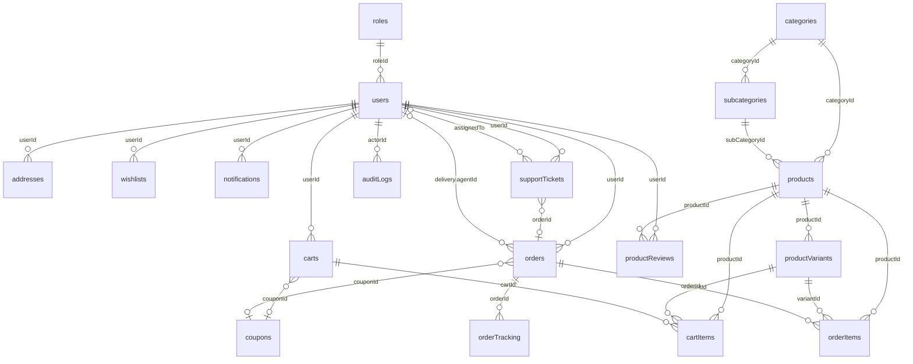

# AshityShop — PostgreSQL Database Architecture

> Production-ready schema design for a multi-channel e-commerce platform (Android, Web, future iOS).  
> Database: Supabase PostgreSQL (`ashityshop`)

---

## Table of Contents

1. [Recommended PostgreSQL Architecture](#1-recommended-postgresql-architecture)
2. [Table List](#2-table-list)
3. [ERD — Entity Relationships](#3-erd--entity-relationships)
4. [Embedding vs Referencing Decisions](#4-embedding-vs-referencing-decisions)
5. [Enums](#5-enums)
6. [Indexes Summary](#6-indexes-summary)
7. [Constraints & Validation Rules](#7-constraints--validation-rules)
8. [Soft Delete & Auditing](#8-soft-delete--auditing)
9. [Future-Proofing](#9-future-proofing)
10. [Schema File Map](#10-schema-file-map)

---

## 1. Recommended PostgreSQL Architecture (Supabase)

### Deployment Topology

```
┌─────────────────────────────────────────────────────────────────┐
│                     Application Layer                           │
│   Android App  │  Web App  │  Admin Panel  │  Delivery App     │
└────────────────────────────┬────────────────────────────────────┘
                             │
                    ┌────────▼────────┐
                    │   API Gateway   │
                    └────────┬────────┘
                             │
              ┌──────────────▼──────────────┐
              │   Supabase PostgreSQL       │
              │   (Managed Cloud Database)  │
              └──────────────┬──────────────┘
                             │
         ┌───────────────────┼───────────────────┐
         │                   │                   │
  ┌──────▼──────┐    ┌───────▼───────┐   ┌──────▼──────┐
  │  Realtime   │    │  pg_graphql   │   │  S3/CDN     │
  │  (WebSockets)│   │  (Auto-API)   │   │  (images)   │
  └─────────────┘    └───────────────┘   └─────────────┘
```

### Operational Guidelines

| Concern | Recommendation |
|---------|----------------|
| **High Availability** | Supabase Pro plan includes automated backups and Point-in-Time Recovery |
| **Connection Pool** | Supabase provides PgBouncer connection pooling (configured in `supabase.ts`) |
| **Realtime** | Use Supabase Realtime for order status → notifications, inventory sync |
| **Row Level Security** | Enforce multi-tenant data isolation via RLS policies on all tables |
| **Migrations** | Manage schema via SQL migration files in `supabase/migrations/` |
| **Backup** | Automatic daily backups + Point-in-Time Recovery with Pro plan |
| **Scaling** | Upgrade compute add-ons as needed; read replicas available on higher tiers |
| **TTL Cleanup** | Use `pg_cron` or application-level scheduled jobs for expired carts, old notifications |

### Schema Organization (Schemas)

| Schema | Tables | Purpose |
|--------|--------|---------|
| `public` | All transactional tables | OLTP |
| `analytics` | Aggregated metrics (via ETL) | OLAP / dashboards |
| `audit` | `audit_logs` (partitioned) | Compliance isolation |

---

## 2. Table List

| # | Table | Model File | Soft Delete | Audit Fields | Primary Purpose |
|---|-------|------------|:-----------:|:------------:|-----------------|
| 1 | `roles` | `Role.ts` | ✅ | ✅ | RBAC permissions |
| 2 | `users` | `User.ts` | ✅ | ✅ | Authentication & profiles |
| 3 | `addresses` | `Address.ts` | ✅ | ✅ | User shipping/billing addresses |
| 4 | `categories` | `Category.ts` | ✅ | ✅ | Top-level product taxonomy |
| 5 | `subcategories` | `SubCategory.ts` | ✅ | ✅ | Second-level taxonomy |
| 6 | `products` | `Product.ts` | ✅ | ✅ | Product catalog (parent) |
| 7 | `product_variants` | `ProductVariant.ts` | ✅ | ✅ | SKU, price, inventory |
| 8 | `product_reviews` | `ProductReview.ts` | ✅ | ✅ | Customer reviews |
| 9 | `wishlists` | `Wishlist.ts` | ✅ | ✅ | Saved products (embedded items) |
| 10 | `carts` | `Cart.ts` | ✅ | ✅ | Active shopping sessions |
| 11 | `cart_items` | `CartItem.ts` | ✅ | ✅ | Line items (separate for concurrency) |
| 12 | `orders` | `Order.ts` | ✅ | ✅ | Order headers + snapshots |
| 13 | `order_items` | `OrderItem.ts` | ✅ | ✅ | Immutable order line items |
| 14 | `order_tracking` | `OrderTracking.ts` | ❌ | partial | Append-only tracking events |
| 15 | `notifications` | `Notification.ts` | ❌ | ❌ | In-app & push notification log |
| 16 | `coupons` | `Coupon.ts` | ✅ | ✅ | Discount codes |
| 17 | `banners` | `Banner.ts` | ✅ | ✅ | Homepage/promo banners |
| 18 | `support_tickets` | `SupportTicket.ts` | ✅ | ✅ | Customer support |
| 19 | `audit_logs` | `AuditLog.ts` | ❌ | ❌ | Immutable audit trail |
| 20 | `settings` | `Setting.ts` | ✅ | ✅ | App configuration key-value store |

**Total: 20 tables** (as specified)

---

## 3. ERD — Entity Relationships

### High-Level Relationship Diagram



### Cardinality Reference

```
roles          1 ──────< N  users
users          1 ──────< N  addresses
users          1 ──────< N  wishlists
users          1 ──────< 1  carts (active, partial unique index)
users          1 ──────< N  orders
users          1 ──────< N  productReviews (1 per product, unique)
users          1 ──────< N  notifications
users          1 ──────< N  supportTickets

categories     1 ──────< N  subcategories
categories     1 ──────< N  products
subcategories  1 ──────< N  products
products       1 ──────< N  productVariants
products       1 ──────< N  productReviews

carts          1 ──────< N  cartItems
orders         1 ──────< N  orderItems
orders         1 ──────< N  orderTracking (timeline events)

coupons        1 ──────< N  orders (optional)
coupons        1 ──────< N  carts (optional)
```

### Relationship Types Legend

| Symbol | Meaning |
|--------|---------|
| `──<` | One-to-many (reference via foreign key UUID) |
| `}o──o|` | Optional many-to-one |
| Embedded | JSONB columns inside parent row |

---

## 4. Embedding vs Referencing Decisions

| Data | Strategy | Rationale |
|------|----------|-----------|
| **Wishlist items** | **JSONB** in `wishlists` | Bounded size (~500 items max); single-user reads; no cross-user queries |
| **Cart items** | **Reference** (`cart_items` table) | High write concurrency; atomic per-item updates; guest + auth carts |
| **Order line items** | **Reference** (`order_items`) | Unbounded order history; reporting/analytics; partial fulfillment per item |
| **Order addresses** | **JSONB snapshot** in `orders` | Immutable legal record; address book may change after order |
| **Payment details** | **JSONB** in `orders` | 1:1 with order; COD now, gateway fields ready for future |
| **Product variants** | **Reference** | Unbounded variants per product; independent inventory/price updates |
| **Product reviews** | **Reference** | Unbounded growth; moderation queries; unique index per user+product |
| **Order tracking events** | **Reference** (append-only rows) | Timeline grows indefinitely; efficient pagination by `created_at` |
| **Support ticket messages** | **JSONB** (≤200 msgs) | Fast ticket load; migrate to `ticket_messages` table when exceeded |
| **User device tokens** | **JSONB** in `users` | Small array; needed on every push send; indexed by token |
| **Role permissions** | **JSONB** in `roles` | Permissions always loaded with role; rarely exceed hundreds |
| **Product rating aggregate** | **JSONB** in `products` | Denormalized for listing performance; updated via review events |
| **Category → SubCategory** | **Reference** | Subcategories queried independently; admin CRUD separation |

---

## 5. Enums

All enums live in `src/database/enums/index.ts`.

| Enum | Values |
|------|--------|
| `RoleName` | `USER`, `ADMIN`, `SUPER_ADMIN`, `DELIVERY` |
| `UserStatus` | `ACTIVE`, `INACTIVE`, `SUSPENDED`, `PENDING_VERIFICATION` |
| `DevicePlatform` | `ANDROID`, `IOS`, `WEB` |
| `ProductStatus` | `DRAFT`, `PUBLISHED`, `ARCHIVED` |
| `OrderStatus` | `PENDING`, `CONFIRMED`, `PROCESSING`, `SHIPPED`, `OUT_FOR_DELIVERY`, `DELIVERED`, `CANCELLED`, `RETURNED`, `REFUNDED` |
| `OrderItemStatus` | `PENDING`, `CONFIRMED`, `PICKED`, `PACKED`, `SHIPPED`, `DELIVERED`, `CANCELLED`, `RETURNED` |
| `PaymentMethod` | `COD`, `STRIPE`, `PAYPAL`, `RAZORPAY` |
| `PaymentStatus` | `PENDING`, `AUTHORIZED`, `CAPTURED`, `FAILED`, `REFUNDED`, `CANCELLED` |
| `CartStatus` | `ACTIVE`, `ABANDONED`, `CONVERTED`, `EXPIRED` |
| `CouponType` | `PERCENTAGE`, `FIXED`, `FREE_SHIPPING` |
| `CouponApplicability` | `ALL`, `CATEGORIES`, `PRODUCTS` |
| `NotificationType` | `ORDER`, `DELIVERY`, `PROMOTION`, `SYSTEM`, `SUPPORT`, `PAYMENT` |
| `NotificationChannel` | `IN_APP`, `PUSH`, `EMAIL`, `SMS` |
| `BannerLinkType` | `NONE`, `PRODUCT`, `CATEGORY`, `SUBCATEGORY`, `EXTERNAL`, `COUPON` |
| `BannerPlatform` | `ALL`, `WEB`, `ANDROID`, `IOS` |
| `SupportTicketStatus` | `OPEN`, `IN_PROGRESS`, `WAITING_ON_CUSTOMER`, `RESOLVED`, `CLOSED` |
| `SupportTicketPriority` | `LOW`, `MEDIUM`, `HIGH`, `URGENT` |
| `SupportTicketCategory` | `ORDER`, `PAYMENT`, `DELIVERY`, `PRODUCT`, `ACCOUNT`, `OTHER` |
| `AuditAction` | `CREATE`, `UPDATE`, `DELETE`, `SOFT_DELETE`, `RESTORE`, `LOGIN`, `LOGOUT`, `STATUS_CHANGE`, `PERMISSION_CHANGE` |
| `AddressLabel` | `HOME`, `WORK`, `OTHER` |
| `SettingGroup` | `GENERAL`, `PAYMENT`, `SHIPPING`, `NOTIFICATION`, `MOBILE`, `ANALYTICS`, `VENDOR`, `WAREHOUSE` |
| `TrackingEventSource` | `SYSTEM`, `ADMIN`, `DELIVERY`, `CUSTOMER` |

---

## 6. Indexes Summary

### Critical Performance Indexes

| Collection | Index | Type | Query Pattern |
|------------|-------|------|---------------|
| `users` | `{ email: 1 }` | unique | Login |
| `users` | `{ phone: 1 }` | unique, sparse | Phone login |
| `users` | `{ roleId: 1, status: 1, isDeleted: 1 }` | compound | Admin user lists |
| `products` | `GIN (to_tsvector('english', name || ' ' || description))` | GIN | Full-text search |
| `products` | `(category_id, sub_category_id, status)` | btree | Category browsing |
| `product_variants` | `(sku)` | unique btree | Inventory lookup |
| `product_variants` | `(product_id, is_active)` | btree | PDP variant load |
| `carts` | `(user_id, status) WHERE status = 'ACTIVE'` | unique partial | One active cart per user |
| `cart_items` | `(cart_id, variant_id)` | unique btree | Upsert cart line |
| `orders` | `(order_number)` | unique btree | Order lookup |
| `orders` | `(user_id, created_at DESC)` | btree | Order history |
| `orders` | `(delivery_agent_id, status)` | btree | Delivery app queue |
| `order_tracking` | `(order_id, created_at DESC)` | btree | Tracking timeline |
| `notifications` | `(user_id, is_read, created_at DESC)` | btree | Notification inbox |
| `coupons` | `(code)` | unique btree | Coupon validation |
| `audit_logs` | `(entity_type, entity_id, created_at DESC)` | btree | Entity audit trail |

### Geospatial Indexes

| Table | Field | Index Type | Use Case |
|-------|-------|------------|----------|
| `addresses` | `location` | GIST (geometry) | Delivery zone validation |
| `users` | `delivery_profile.current_location` | GIST (geometry) | Nearest delivery agent |
| `order_tracking` | `location` | GIST (geometry) | Live delivery map |

### TTL Cleanup (Application-Level)

| Table | Field | Condition |
|-------|-------|-----------|
| `carts` | `expires_at` | Guest cart cleanup (`status: EXPIRED`) via scheduled job |
| `notifications` | `expires_at` | Optional retention policy via scheduled job |

---

## 7. Constraints & Validation Rules

### Unique Constraints

| Table | Columns | Notes |
|-------|---------|-------|
| `roles` | `name` | System role names |
| `users` | `email` | UNIQUE index — stored lowercase |
| `users` | `phone` | UNIQUE nullable — not all users have phone |
| `categories` | `slug` | UNIQUE — URL-safe |
| `subcategories` | `(category_id, slug)` | UNIQUE — within category |
| `products` | `slug` | UNIQUE — global product URL |
| `product_variants` | `sku`, `barcode` | UNIQUE — inventory identifiers |
| `product_reviews` | `(product_id, user_id)` | UNIQUE — one review per user per product |
| `carts` | `(user_id) WHERE status = 'ACTIVE'` | Partial unique index |
| `cart_items` | `(cart_id, variant_id)` | UNIQUE |
| `orders` | `order_number` | UNIQUE — human-readable ID |
| `coupons` | `code` | UNIQUE — uppercase normalized |
| `support_tickets` | `ticket_number` | UNIQUE — support reference |
| `settings` | `key` | UNIQUE — dot-notation config keys |
| `wishlists` | `(user_id, name)` | UNIQUE — named wishlists |

### Field Validation Highlights

- **Email**: regex `/^\S+@\S+\.\S+$/`, max 254 chars, stored lowercase
- **Slug**: regex `/^[a-z0-9]+(?:-[a-z0-9]+)*$/`
- **Rating**: integer 1–5
- **Cart quantity**: 1–99
- **Coupon code**: alphanumeric uppercase `[A-Z0-9_-]+`
- **Geo coordinates**: `[longitude, latitude]` with range validation
- **Wishlist**: max 500 embedded items
- **Support ticket**: max 200 embedded messages (migration trigger)
- **Review images**: max 5 per review

---

## 8. Soft Delete & Auditing

### Soft Delete

Applied to all tables **except**:
- `order_tracking` — append-only event log
- `notifications` — hard delete after TTL
- `audit_logs` — immutable, never deleted

Columns added: `is_deleted`, `deleted_at`, `deleted_by`

Repositories implement: `softDelete()`, `restore()`, `findWithDeleted()` via the `BaseRepository`.

### Audit Fields

Applied to all soft-deletable tables plus transactional tables.

| Column | Type | Purpose |
|--------|------|---------|
| `created_by` | UUID → users | Who created the record |
| `updated_by` | UUID → users | Last modifier |
| `created_at` | Timestamptz | Auto |
| `updated_at` | Timestamptz | Auto |

### Audit Logs (`audit_logs`)

Separate immutable table for compliance:
- Captures before/after snapshots on critical entities
- Stores IP, user agent, request ID
- Never soft-deleted; consider archival to cold storage after 2 years

---

## 9. Future-Proofing

### Payment Gateways

`orders.payment` stores as JSONB:
```json
{
  "method": "COD",           // extend to STRIPE, PAYPAL, RAZORPAY
  "status": "PENDING",
  "transaction_id": null,
  "gateway_response": {},    // JSONB — store raw gateway payload
  "paid_at": null,
  "refunded_at": null,
  "refund_amount": 0
}
```

### Multi-Vendor Marketplace

Nullable `vendor_id` on: `users`, `categories`, `products`, `product_variants`, `cart_items`, `order_items`, `orders`, `coupons`

Future tables (not in scope now):
- `vendors` — seller profiles, commission rates
- `vendor_payouts` — settlement records

### Warehouse Management

`product_variants.inventory.warehouse_id` and `order_items.warehouse_id` reference future `warehouses` table.

Future tables:
- `warehouses` — location, capacity
- `inventory_movements` — stock in/out audit trail
- `stock_transfers` — inter-warehouse transfers

### Mobile Push Notifications

`users.device_tokens` stores as JSONB:
```json
{ "token": "...", "platform": "ANDROID"|"IOS"|"WEB", "device_id": "...", "is_active": true, "last_used_at": "..." }
```

Push delivery tracked via `notifications` table with `channels: ['PUSH']` and `delivery_status`.

### Recommended Additional Tables (when scaling)

| Table | Purpose |
|-------|---------|
| `coupon_usages` | `{ coupon_id, user_id, order_id, used_at }` — enforce `per_user_limit` |
| `ticket_messages` | Split from JSONB when tickets exceed 200 messages |
| `refresh_tokens` | Separate table if token rotation volume is high |

---

## 10. Schema File Map

```
src/database/
├── index.ts                 # Public exports
├── connection.ts            # Supabase connection helper
├── supabase.ts              # Supabase client wrappers
├── enums/
│   └── index.ts             # All enum definitions
├── plugins/
│   └── index.ts             # Shared sub-schemas / interfaces (IAuditFields, ISoftDeleteFields)
├── models/
│   ├── index.ts             # Model barrel export
│   ├── Role.ts
│   ├── User.ts
│   ├── Address.ts
│   ├── Category.ts
│   ├── SubCategory.ts
│   ├── Product.ts
│   ├── ProductVariant.ts
│   ├── ProductReview.ts
│   ├── Wishlist.ts
│   ├── Cart.ts
│   ├── CartItem.ts
│   ├── Order.ts
│   ├── OrderItem.ts
│   ├── OrderTracking.ts
│   ├── Notification.ts
│   ├── Coupon.ts
│   ├── Banner.ts
│   ├── SupportTicket.ts
│   ├── AuditLog.ts
│   └── Setting.ts
└── repositories/
    ├── index.ts             # Repository barrel export
    ├── BaseRepository.ts    # Generic CRUD (findById, create, updateById, deleteById, count, etc.)
    ├── UserRepository.ts
    ├── ProductRepository.ts
    ├── OrderRepository.ts
    └── ...
```

### Usage

```typescript
import { connectDatabase } from './src/database/connection.js';
import { getAdminClient } from './src/database/supabase.js';

await connectDatabase();

const { data: products } = await getAdminClient()
  .from('products')
  .select('*')
  .eq('status', 'PUBLISHED')
  .eq('is_featured', true)
  .order('rating_average', { ascending: false })
  .limit(20);
```

---

## Order Lifecycle (Reference)

```
PENDING → CONFIRMED → PROCESSING → SHIPPED → OUT_FOR_DELIVERY → DELIVERED
    │          │            │          │
    └──────────┴────────────┴──────────┴──→ CANCELLED
                                              │
DELIVERED ──────────────────────────────→ RETURNED → REFUNDED
```

Each status transition creates an `orderTracking` document and optionally a `notifications` document.

---

*Document version: 1.0 — AshityShop Database Architecture*
